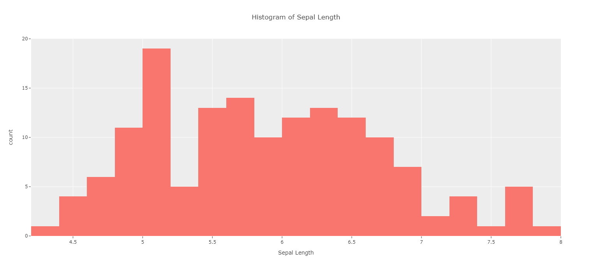

Vignette / Tutorial
======================

.. note::
   Before you begin, you need to have certain packages installed. Be sure to 
   download the following via pip install:
   
   * numpy
   * pandas
   * plotly
   * plotly.express
   * plotly.graph_objects
   * plotly.offline

This tutorial will show you the basic things that can be done with this Plotly repo with the current assortment of charts available.

First, you will want to import the following:

.. code-block:: Python

  from interactive_visuals import *

=============
Control Chart
=============

For creating control charts, the data frame must contain variables named the same as in the example below. Make sure the Date variable is set to the index if it isn't already (ADTK will do this by default). Load in the Interactive_Visuals class and then call the plot function.

.. code-block:: Python

  df = pd.DataFrame(dict(
          Date=["2020-01-10", "2020-02-10", "2020-03-10", "2020-04-10", "2020-05-10", "2020-06-10", "2020-07-10"],
          Values=[1,2,3,1,2,4, 5],
          Median = [2,2,2,2,2,2,2],
          UCL = [3,3,3,3,3,3,3],
          LCL = [1,1,1,1,1,1,1],
          Violation = [0,0,0,0,0,.5, .9]
      ))
  
  #Pandas set date to index col (will be how ingested from ADTK)
  df = df.set_index("Date")
  iv = Interactive_Visuals(df)
  plot(iv.control_chart_ADTK(title = "Anomaly Detection Graph"))

.. image:: images/Control_Chart.png
   :width: 800

===========
Scatterplot
===========

There are a few variations on what can be done with a scatter plot. First you will want to load in a data frame (here, we'll be using the infamous iris dataset).

.. code-block:: Python

  df = px.data.iris()
  iv = Interactive_Visuals(df)
  
To obtain a very basic scatterplot, run this:

.. code-block:: Python

  plot(iv.scatterplot(x = "sepal_length", y = "sepal_width"))

Marginal Scatterplot
^^^^^^^^^^^^^^^^^^^^^^^^^^^^^^^^^^^^^^^^^^^^^^^^^

To create a scatterplot with a marginal box plot, run the following:

.. code-block:: Python

  plot(iv.scatterplot(x = "sepal_length", y = "sepal_width", marg_x = "box", marg_y = "box"))

.. image:: images/Scatterplot_Marginal.png
   :width: 800

(Note that histograms or violin plots can also be plotted in the margins.)

Change Colors Based on Another Variable
^^^^^^^^^^^^^^^^^^^^^^^^^^^^^^^^^^^^^^^^^^^^^^^^^

Scatterplots can be labeled based on a factor variable:

.. code-block:: Python

  plot(iv.scatterplot(x = "sepal_length", y = "sepal_width", 
  marg_x = "box", marg_y = "box", color = "species"))

  
Or a numeric variable:

.. code-block:: Python

  plot(iv.scatterplot(x = "sepal_length", y = "sepal_width", 
  marg_x = "box", marg_y = "box", color = "petal_width"))

.. image:: images/Scatterplot_Marginal_Numeric.png
   :width: 800

Prettify with Jitter and Opacity
^^^^^^^^^^^^^^^^^^^^^^^^^^^^^^^^^^^^^^^^^^^^^^^^^

If points overlap, jitter can be applied. If the default jitter is unsatisfactory, the value can be changed with jitter_sd:

.. code-block:: Python

  plot(iv.scatterplot(x = "sepal_length", y = "sepal_width", 
  marg_x = "box", marg_y = "box", color = "species", jitter = True))

.. image:: images/Scatterplot_Marginal_Jitter.png
   :width: 800

Opacity can also be lowered for points closeby to be more easily seen:

.. code-block:: Python

  plot(iv.scatterplot(x = "sepal_length", y = "sepal_width", 
  marg_x = "box", marg_y = "box", color = "species", 
  jitter = True, opacity = .5))

.. image:: images/Scatterplot_Marginal_Opacity.png
   :width: 800

Add Trendlines
^^^^^^^^^^^^^^^^^^^^^^^^^^^^^^^^^^^^^^^^^^^^^^^^^

Trendlines can also be added via "ols":

.. code-block:: Python

  plot(iv.scatterplot(x = "sepal_length", y = "sepal_width", 
  marg_x = "box", marg_y = "box", color = "species", jitter = True, 
  opacity = .8, trendline = "ols"))

=========
Histogram
=========

A basic histogram can be created by using a numeric variable:

.. code-block:: Python

  plot(iv.histogram(x = "sepal_length"))   

Facet on Categorical Variable
^^^^^^^^^^^^^^^^^^^^^^^^^^^^^^^^^^^^^^^^^^^^^^^^^

This histogram can be split based on a categorical variable:

.. code-block:: Python

  plot(iv.histogram(x = "sepal_length", color = "species"))  

.. image:: images/Histogram_Factor.png
   :width: 800

Show Marginal Distribution
^^^^^^^^^^^^^^^^^^^^^^^^^^^^^^^^^^^^^^^^^^^^^^^^^

The marginal distributions can be shown above the histogram:

.. code-block:: Python

  plot(iv.histogram(x = "sepal_length", color = "species", marginal="box"))  

.. image:: images/Histogram_Marginal.png
   :width: 800

Facet Plots
^^^^^^^^^^^^^^^^^^^^^^^^^^^^^^^^^^^^^^^^^^^^^^^^^

And the plots can be faceted either vertically or horizontally for readability:

.. code-block:: Python

  plot(iv.histogram(x = "sepal_length", color = "species", facet_col = "species", marginal="box")) 

Customize Bins
^^^^^^^^^^^^^^^^^^^^^^^^^^^^^^^^^^^^^^^^^^^^^^^^^

The number of bins is also customizable:

.. code-block:: Python

  plot(iv.histogram(x = "sepal_length", color = "species", facet_col = "species",
  marginal = "box", bins = 10)) 

Titles
^^^^^^^^^^^^^^^^^^^^^^^^^^^^^^^^^^^^^^^^^^^^^^^^^

Titles can be removed if disruptive:

.. code-block:: Python

  plot(iv.histogram(x = "sepal_length", color = "species", facet_col = "species",
  marginal = "box", bins = 10, has_title = False)) 

Or renamed to what the user prefers:

.. code-block:: Python

  plot(iv.histogram(x = "sepal_length", color = "species", facet_col = "species",
  marginal = "box", bins = 10, title = "Sepal Length Faceted on Species")) 

.. image:: images/Histogram_CustomTitle.png
   :width: 800

========
Bar Plot
========

For bar plots we will use a dataset where more categorical variables are included:

.. code-block:: Python

  df = px.data.tips()
  iv = Interactive_Visuals(df)

A basic bar plot can be created by using a categorical variable:

.. code-block:: Python

  plot(iv.barplot(x = "sex"))

Stacked Bar Plots
^^^^^^^^^^^^^^^^^^^^^^^^^^^^^^^^^^^^^^^^^^^^^^^^^

Stacked bar plots can be created by setting a categorical variable to color:

.. code-block:: Python

  plot(iv.barplot(x = "sex", color = "smoker"))

.. image:: images/Barplot_Stacked.png
   :width: 800

Grouped Bar Plots
^^^^^^^^^^^^^^^^^^^^^^^^^^^^^^^^^^^^^^^^^^^^^^^^^

These can also be set as grouped bar plots:

.. code-block:: Python

  plot(iv.barplot(x = "sex", color = "smoker", barmode = "group"))

.. image:: images/Barplot_Grouped.png
   :width: 800

Horizontal Bars
^^^^^^^^^^^^^^^^^^^^^^^^^^^^^^^^^^^^^^^^^^^^^^^^^

Bars can also be set horizontally:

.. code-block:: Python

  plot(iv.barplot(x = "sex", color = "smoker", is_horizontal = True))

.. image:: images/Barplot_Horizontal.png
   :width: 800

Plot on Percentages
^^^^^^^^^^^^^^^^^^^^^^^^^^^^^^^^^^^^^^^^^^^^^^^^^

And bar plots can be plotted based on Percentages and not Counts:

.. code-block:: Python

  plot(iv.barplot(x = "sex", color = "smoker", is_horizontal = True, is_percent = True))

   
Add Actual Values Onto Plots
^^^^^^^^^^^^^^^^^^^^^^^^^^^^^^^^^^^^^^^^^^^^^^^^^

If graphs are going into PowerPoints, actual values can be added to graphs for both count and percentage cases (percents automatically round to two decimal places):

.. code-block:: Python

  plot(iv.barplot(x = "sex", color = "smoker", is_horizontal = True, 
  is_percent = True, show_num = True))

.. image:: images/Barplot_Values.png
   :width: 800